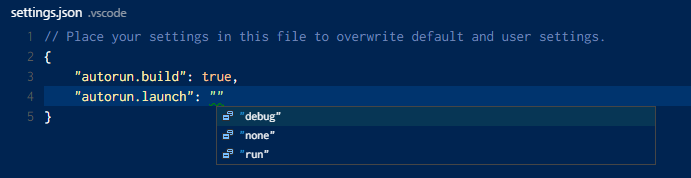

# vscode-autorun

Automatically runs the build task and/or debug/run the launch configuration whenever a folder is opened in VS Code.

## Extension Settings

`autorun` must be enabled by configuring these seetings:

* `autorun.build`: If .vscode/tasks.json exists and this setting is `true`, runs the 'Run Build Task' command
* `autorun.launch`: If .vscode/launch.json exists, runs either the 'Start Debugging' (=`"debug"`) or 'Start Without Debugging' (=`"run"`) command

### 1.0.0

Initial release